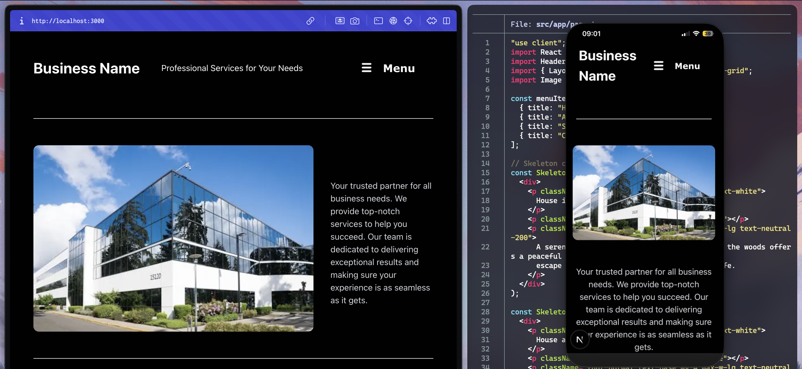
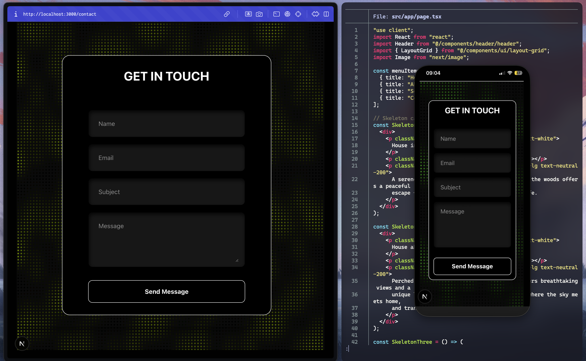

 Business Portfolio Template

A **clean, responsive business portfolio template** built with **Next.js, React, Tailwind CSS, and TypeScript**.  
This project is designed to be a **quick and easy starting point** for businesses who want a modern and professional online presence.  

All code is **100% open source** and customizable to fit your needs.

---

## ✨ Features
- 🚀 Built with **Next.js** and **React** for performance and flexibility  
- 🎨 Styled with **Tailwind CSS** for easy customization  
- 📱 Fully **responsive** — works smoothly on both desktop and mobile  
- ⚡️ TypeScript support out of the box  
- 🧩 Modular components (header, menu, contact form, etc.) for quick reusability  

---

## 🛠️ Tech Stack
- [Next.js](https://nextjs.org/)  
- [React](https://react.dev/)  
- [Tailwind CSS](https://tailwindcss.com/)  
- [TypeScript](https://www.typescriptlang.org/)  

---

## 📦 Installation & Setup

1. Clone the repository:
   ```bash
   git clone https://github.com/shpat-devv/NextJSTemplate.git
   cd NextJSTemplate
   ```

2. Install dependencies:
```bash
npm install
```

3. Run the development server:
```bash
npm run dev
# or
yarn dev
# or
pnpm dev
# or
bun dev
```

Open [http://localhost:3000](http://localhost:3000) with your browser to see the result.

## Learn More

To learn more about Next.js, take a look at the following resources:

- [Next.js Documentation](https://nextjs.org/docs) - learn about Next.js features and API.
- [Learn Next.js](https://nextjs.org/learn) - an interactive Next.js tutorial.

You can check out [the Next.js GitHub repository](https://github.com/vercel/next.js) - your feedback and contributions are welcome!

## Deploy on Vercel

The easiest way to deploy your Next.js app is to use the [Vercel Platform](https://vercel.com/new?utm_medium=default-template&filter=next.js&utm_source=create-next-app&utm_campaign=create-next-app-readme) from the creators of Next.js.

Check out our [Next.js deployment documentation](https://nextjs.org/docs/app/building-your-application/deploying) for more details.

## Preview



